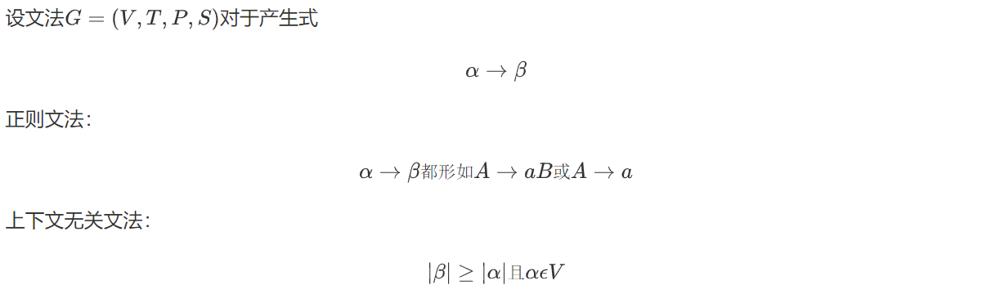
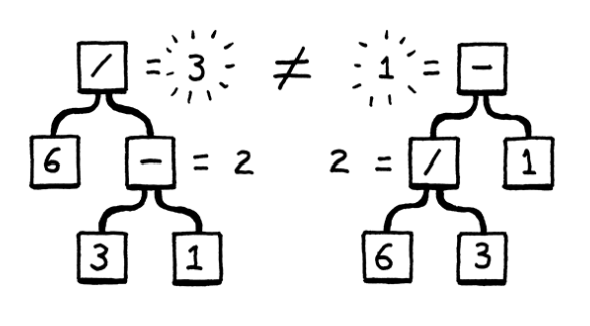
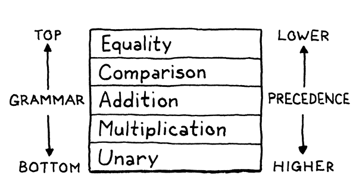

<!-- TOC -->

- [相关教程](#相关教程)
- [搭建过程](#搭建过程)
  - [词法分析器](#词法分析器)
    - [词法单元](#确定词法单元种类)
    - [推导](#确定推导规则)
    - [归约](#根据推导规则对输入进行规约)
    - [符号表](#插入符号表)
  - [语法分析器](#语法分析器)
    - [上下文无关文法](#1.上下文无关文法)
    - [语法树](#2.语法树)
    - [语法](#3.语法)
    - [语法分析](#4.语法分析)
    - [语法错误](#5.语法错误)

<!-- /TOC -->

***
# 相关教程
[interpreter](http://www.craftinginterpreters.com/)

[shell](https://brennan.io/2015/01/16/write-a-shell-in-c/)

[8cc C compiler](https://github.com/rui314/8cc)

***

# 搭建过程

## 词法分析器

### 1.确定词法单元种类
```
    // \t \v \ n \f 占位符 直接忽略
    // /**/ // 注释 直接忽略

    // 标点符号
    LEFT_PAREN, RIGHT_PAREN, LEFT_BRACE, RIGHT_BRACE, // () {}
    LEFT_BRACKET, RIGHT_BRACKET, LEFT_ANGLE, RIGHT_ANGLE, // [] <>
    COMMA, DOT, SEMICOLON, QUESTION, COLON, // , . ; ? :

    // 一元运算符和二元运算符
    PLUS, PLUS_PLUS, PLUS_EQUAL, // + ++ +=
    MINUS, MINUS_MINUS, MINUS_EQUAL, POINT, // - -- -= ->
    DIVIDE, DIVIDE_EQUAL, // / /=
    MULTIPLY, MULTIPLY_EQUAL, // * *=
    MOD, MOD_EQUAL, // % %=
    BANG, BANG_EQUAL, // ! !=
    EQUAL, EQUAL_EQUAL, // = ==
    GREATER, SHIFT_RIGHT, GREATER_EQUAL, // > >> >=
    LESS, SHIFT_LEFT, LESS_EQUAL, // < << <=
    AND, AND_AND, AND_EQUAL, // & && &=
    OR, OR_OR, OR_EQUAL, // | || |=
    XOR, XOR_AND, // ^ ^=
    NOT, NOT_EQUAL, // ~ ~=

    // 关键字
    RETURN, VOID, EXTERN, SIZEOF, TYPEDEF, REGISTER, VOLATILE,// return void extern sizeof typedef register volatile

    FLOAT, INT, CHAR, DOUBLE, AUTO, // float int char double auto
    LONG, SHORT, CONST, SIGNED, UNSIGNED, STATIC, // long short const signed unsigned static
    ENUM, STRUCT, UNION, // enum struct union
    FALSE, TRUE, NULL, // false true

    FOR, IF, WHILE, DO, ELSE, SWITCH, CASE, // for if while do else switch case
    BREAK, CONTINUE, DEFAULT, GOTO, // break continue default goto

    IDENTIFIER, NUMBER, STRING, // 标识符 数字 字符串
    EOF // 文件末尾标识符
```

<br/>

### 2.确定推导规则
- 由一般到到个别(演绎)
- 使用**正则文法**规定格式(DFA与正则表达式等价)

以数字为例, number分三部分: 整数/浮点数/指数
```
digit -> [0-9]
digits -> digit+
number -> digits (. digits)? (E[+-]? digits)?
```
<!--
$$
digit \rightarrow [0-9]
\\
digits \rightarrow digit^+
\\
number \rightarrow digits (. digits)? (E[+-]? digits)?
$$
-->

<br/>


### 3.根据推导规则对输入进行规约
- 由个别到一般(归纳)
- 识别输入字符，如果词素符合某个推导模式，则保存为对应词法单元
```
switch (c) {
            // 标点符号: 包括左右括号 逗号 分号
            case '(': addToken(TokenType.LEFT_PAREN);  break;
            // 一元运算符
            case '+': addToken(TokenType.PLUS);        break;
            // 一元运算符或二元运算符
            case '!': addToken(match('=') ? TokenType.BANG_EQUAL : TokenType.BANG); break;
            // 空白符 换行符 制表符
            case ' ':
            case '\t': break;
            case '\n':
                line++;
                break;
            // 字符串
            case '"':
                strings();
                break;
            default:
                if(isDigit(c)) { // 数字
                    number();
                }else if (isAlpha(c)) { // 标识符或关键字
                    identifier();
                }
                break;
        }
```

<br/>

### 4.插入符号表
- 符号类
```
public class Token {
    final TokenType type; // 种类
    final String lexeme; // 标识符
    final Object literal; // 字面量
    final int line; // 行数
}
```

- 运算符 标点符号 关键字
  
  不需要属性值
  
  `tokens.add(new Token(type, lexeme, line));`

- 标识符
  
  属性值: 指向符号表中该标识符对应条目的指针
  
  符号表条目: 词素 类型 出现位置

  `tokens.add(new Token(type, lexeme, literal, line));`

***

## 语法分析器

### 1.上下文无关文法

前面我们使用了**正则文法**处理字符(*char*)，将字符整合成字符串(*Token*)，这是词法分析

现在我们要用**上下文无关语法**来进行语法分析，过程与词法分析差不多

- 定义语法推导式
- 根据语法推导式对输入词素(*Token*)进行规约

<br/>

关于两类语法的区别，这里简单提一下，直接看定义：


区别在于，正则文法是左线性或者右线性的，产生式必带有终结符

而上下文无关文法是非终结符和终结符的任意组合

因此，正则文法适合处理字符(终结符)，而上下文无关文法适合处理词素(非终结符)

<!--

设文法$G=(V,T,P,S)$对于产生式
$$
\alpha \rightarrow \beta
$$
正则文法：
$$
\alpha \rightarrow \beta都形如A\rightarrow a B或A\rightarrow a
$$

上下文无关文法：
$$
|\beta|\geq|\alpha|且\alpha \epsilon V
$$
-->

<br/>

### 2.语法树

#### 2.1.自动生成语法树

从根节点(非终结符)出发，自顶向下构建语法树。

每个语法(推导式)对应一个语法树(类)，每个语法树类包括成员变量、相应的操作函数

```
Binary -> left operator right
```

```java
abstract class Expr { 
  static class Binary extends Expr {
    Binary(Expr left, Token operator, Expr right) {
      this.left = left;
      this.operator = operator;
      this.right = right;
    }

    final Expr left;
    final Token operator;
    final Expr right;
      
    String parse(){}
  }

  // Other expressions...
}
```

我们会设计很多语法推导式，然后编写很多语法树类，但这样很麻烦。我们希望定义语法推导式，然后自动生成语法树类。

于是，我们编写了一个工具类`tool/GenerateAst.java`，根据指定语法生成语法树类`Expr.java`

<br/>

#### 2.2.访问者模式(*visitor pattern*)

假设我们已经生成了许多语法树类，考虑下面两个问题：

- 新增一个语法树类，需要再次实现我们规定的操作方法


- 新增一个操作方法，需要在每一个类中提供相应的实现


<br/>

其实，这两个问题对应两种不同风格的语言：

- 对于面向对象式语言，我们定义一个抽象基类和相关的抽象方法，让其他子类继承，即可解决前者

- 对于函数式语言，我们将数据与操作分开，这让后者很容易解决

<br/>

我们是否可以试着结合这两种模式，做一些妥协：

- 定义操作接口类，每个操作类都要实现并重写(override)该接口类

这让添加新操作变得容易

- 定义语法树类基类，每个语法树类都要继承基类，调用操作接口，通过重载(overload)操作函数访问

这让添加新语法树类变得容易

<br/>

综合这两种思想，就是*visitor pattern*，具体见[访问者模式](https://www.jianshu.com/p/1f1049d0a0f4)

代码实现见`Expr.java`和`VisitAst.java`

<br/>

### 3.语法
- 在上下文无关文法中,我们可以通过文法来随意生成strings
- **Parsing:** 给定一个string(一系列标记),将这些标记映射到语法中的终结符来找到一个生成此string的规则
- Parsing 需要处理**歧义**
#### 3.1.歧义
- 6/3-1可以有**两种生成树,造成歧义**:
(6/3)-1 和 6/(3-1)



- 消除歧义:
  - 运算优先级: 除法比加法更优先
  - 结合性: 
      从左到右结合: 5-3-1 => (5-3)-1 
      从右到左结合: a = b = c => a = (b = c)

#### 3.2.优先级

- 如果没有明确定义优先级和结合性,使用多个操作符的表达式就会具有歧义性——它可以被解析为不同的语法树，从而得到不同的结果。**C语言的优先级表如下:**

| Name | Operators | Associates | Explain | Operand |
|  :----:  | :----: | :----: | :----: | :----: |
| 低优先级 | | | | |
| conditional | ? : | Right | 条件运算符 | 三目 |
| logior | \|\| | Left | 逻辑或 | 双目 |
| logiand | && | Left | 逻辑与 | 双目 |
| or | \| | Left | 或 | 双目 |
| xor | ^ | Left | 异或 | 双目 |
| and | & | Left | 与 | 双目 |
| equality | == != | Left | 等于 不等于 | 双目 |
| comparison | > >= < <= | Left | 比较运算符 | 双目 |
| move | << >> | Left | 左移 右移 | 双目 |
| term | - + | Left | 加 减 | 双目 |
| factor | / * % | Left | / * 模 | 双目 |
| unary | ! ~ - + ++ -- * & (T) sizeof | Right | 否定,非,正负号,++,--,解指针,取地址,类型转换,sizeof | 单目 |
| get | () [] -> . | Left | 括号,数组,结构成员访问 | 双目 |
| primary | 文本 和 带括号的表达式 | | | |
| 高优先级 | | | | |

#### 3.3.右递归文法

- 现在可以根据运算优先级写出如下文法来进行parsing:
  
  ```
  expression -> ...
  conditional -> ...
  :
  :
  :
  primary -> ...
```
  
- 每种规则只匹配对应的表达式或更高优先级的表达式
  - 如: 
    ```
      factor -> factor ('\*' | '/') unary | unary 
      unary -> ("!" | "-") unary | primary
      primary -> NUMBER | STRING | "true" | "false" | "null"
               | "(" expression ")" ;
    ```
    
   - **这样factor就可以匹配任何乘除表达式**
    
  - 去除左递归后就可以得到一个 无歧义 可以用来 parsing的文法:
    ```
      expression     → equality ;
      equality       → comparison ( ( "!=" | "==" ) comparison )* ;
      comparison     → term ( ( ">" | ">=" | "<" | "<=" ) term )* ;
      term           → factor ( ( "-" | "+" ) factor )* ;
      factor         → unary ( ( "/" | "*" ) unary )* ;
      unary          → ( "!" | "-" )* primary ;
      primary        → NUMBER | STRING | "true" | "false" | "NULL"
                     | "(" expression ")" ;
    ```
    
    进一步写为：
    
    ```
     Expression -> Condition
     Conditition -> (Logior ? Logior : Condition) | Logior
     Logior -> (Logiand || Logior) | Logiand
     Logiand -> (Or && Logiand) | Or 
     Or -> (Xor | Or) | Xor
     Xor -> (And ^ Xor) | And
     And -> (Equality & And) | Equality
     Equality -> (Comparison [==,!=] Equality) | Comparison
     Comparison -> (Move [>,>=,<,<=] Comparison) | Move
     Move -> (Term [<<,>>] Move) | Term
     Term -> (Factor [-,+] Term) | Factor
     Factor -> (Unary [/,*,%] Factor) | Unary
     Unary -> ([~,&,*,!,-,+,++,--] Unary) | Primary
     Primary -> NUMBER | STRING | true | false | NULL | "(" Expression ")"
    ```
    
    

### 4.语法分析

#### 4.1.递归下降分析

- 有前面的文法,就可以进行递归下降分析( recursive decent parsing )
- 在递归下降中,从高语法层向低语法层分析,但高语法层通常为低的运算优先层,因为低运算优先层可能包含了高运算优先层


- 递归下降parser是将文法直接翻译成代码,每条文法规则都变成一个函数
- 文法直接或间接引用自身就造成了递归

- 根据文法,写出Parser类
```java
package com.craftinginterpreters.lox;

import java.util.List;

import static com.craftinginterpreters.lox.TokenType.*;

class Parser {
  private final List<Token> tokens;
  private int current = 0;

  Parser(List<Token> tokens) {
    this.tokens = tokens;
  }
}
```
- **每条规则都改写为Parser类中的一个函数**
- 具体代码见 `Parser.java` 
#### 4.2.LR语法分析

**目标文法**

```
E → E+T | E-T | T
T → T*F | T/F | T
F → (E) | num
```


### 5.语法错误

- parser两大功能:

  1. 对一个正确的token串,返回一个相应的syntax tree

  2. 对一个不合法的token串,**检测任何错误并告知用户**

- 我们已经讨论过现在讨论过第一大功能,现在来讨论错误检测(error detected)

- 错误检测的几大要求:

  - **有错误必须要被检测出来**
  - **parser遇到错误不能崩溃**

  **以上是硬性要求,以下为可选要求**

  - **Be fast**
  - 报告尽可能多的错误,而不是改一个报一个
  - 尽量避免级联错误,即改了一个错后,会消失几个错误,有些错误是副作用,不需要报告

#### 5.1.错误恢复

- 解析器响应错误并继续寻找以后的错误的方式称为错误恢复
- 上个世纪错误恢复非常缓慢,但现在没这个烦恼

#### 5.2.panic mode

- parser发现一个错误就进入恐慌模式
- **同步化:** 进入恐慌模式后,需要获取当前状态并且与下一个令牌同步,确保下一个令牌符合 parsing 规则
  - **如何同步化parser状态:** 在java中**使用异常**进行同步parser的状态
    - 想要同步时,抛出parseError,在下一个语句开始处catch error,使parser 回归正常状态
    - 同步完parser状态后就进行同步令牌
  - **如何同步化令牌:** 选取某些规则作为同步点,一直丢弃令牌直到到达同步点进行同步
  - 隐藏在丢弃令牌的错误都不会被报告,也就不会报告级联错误
  - 在真正的编译器中,通常在下一个语句的开始处同步
    - 下一个语句的边界通常很好确定: 分号之后, 或 if , for 通常是语句的开始
    - 在current到达边界之前,都应该丢弃当前token
- 具体代码见`Parser.java`

