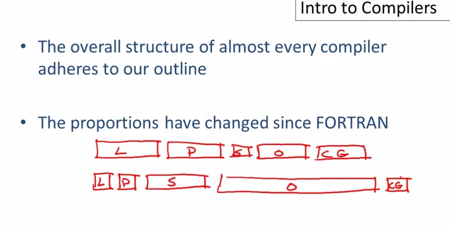
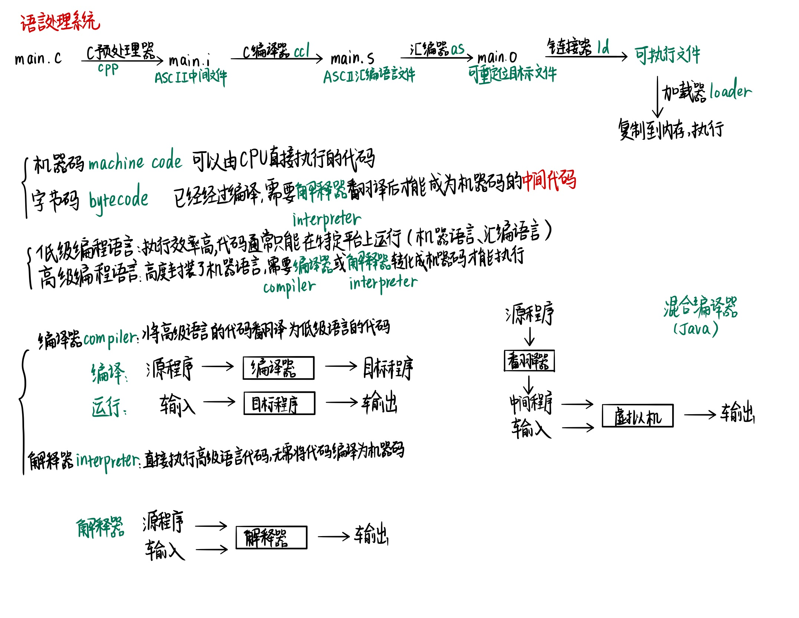
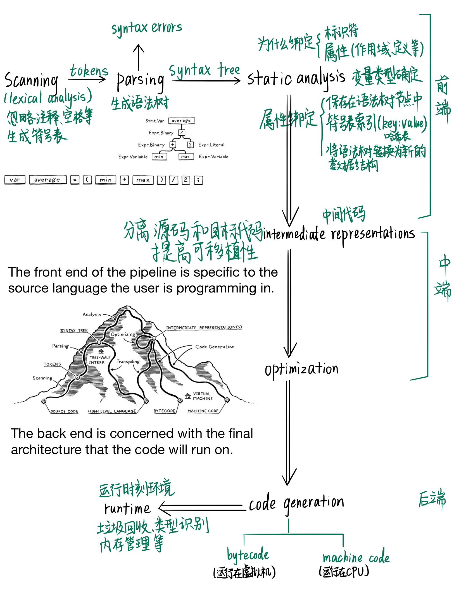

<!-- TOC -->

- [相关教程](#相关教程)
- [写在前面](#写在前面)
- [搭建过程](#搭建过程)
  - [09/25/2020](#09252020)
  - [09/26/2020](#09262020)
- [笔记](#笔记)
  - [基本概念](#基本概念)
  - [总览](#总览)

<!-- /TOC -->

***
## 相关教程
[interpreter](http://www.craftinginterpreters.com/)

[shell](https://brennan.io/2015/01/16/write-a-shell-in-c/)

[compiler](https://norasandler.com/2017/11/29/Write-a-Compiler.html)

## 写在前面

这学期我觉得很忙，有计算机网络和编译原理这两门计算机的大课，更不用说硬核的数值分析和其他专业选修。

所以，我创建这个项目的目的就是希望能集思广益，大家分别负责一些部分的学习，然后分享出来，促进各自的理解。

关于看书的方面，从我的个人角度来讲，绝不应该从头到尾一步一步看完；而是首先应该了解知识的框架，知道有哪些部分，每部分讲了什么。知道了框架，然后再确定自己要钻研具体的部分。

毕竟，我们是来解决问题的，不是当专家。我们是以一个程序员的视角：**A programmer's perspective**

具体参见：

[计算机学习的思考](https://www.zhihu.com/question/22608820/answer/21968467)

[编译原理学习经验](https://www.zhihu.com/question/27500017/answer/36958332)

> **L** short for Lexical analysis

> **P** short for Parsing

> **S** short for Semantic analysis

> **O** short for Optimization

> **CG** short for Code Generation

***

## 搭建过程

### 09/25/2020
根据《编译原理》第二章的词法分析部分，复制了书上的源码

Lexer: 分析处理

Token, Word, Num: 词法单元

Tag: tokentype 词法单元的种类

### 09/26/2020
根据interpreter(详见相关教程)，更改源码，进行扩充 

***

## 笔记

### 基本概念

[参考链接](https://juejin.im/post/6844903853805027335)

### 总览

***
