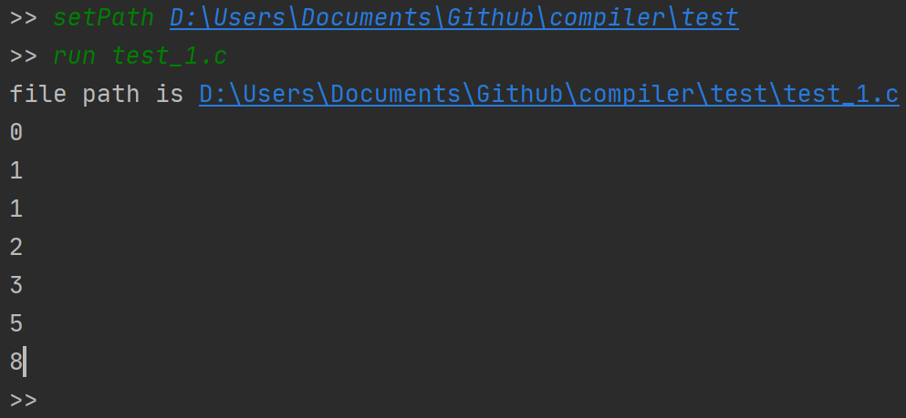

# 相关教程

[interpreter](http://www.craftinginterpreters.com/)

[shell](https://brennan.io/2015/01/16/write-a-shell-in-c/)

[8cc C compiler](https://github.com/rui314/8cc)

# 运行实例

测试代码：

```
var a = 0;
var b = 1;

while (a < 10) {
    print a;
    var temp = a;
    a = b;
    b = temp + b;
}
```

使用命令：

```
setPath .\test
run test_1.c
```

结果



# 项目结构

[structure](./doc/structure.md)

# 搭建过程

[tutorial](./doc/tutorial.md)

